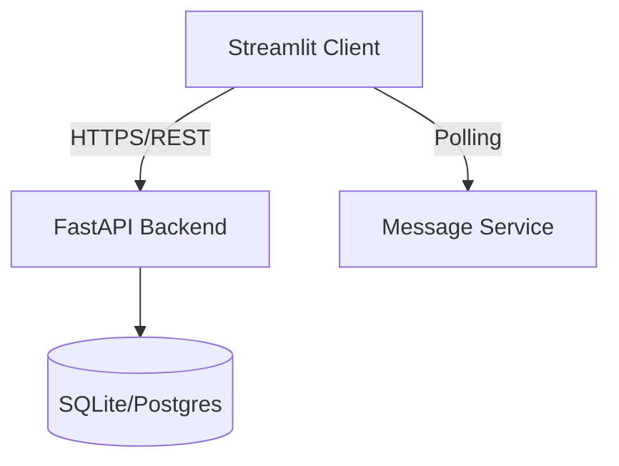

# System Architecture

## Overview
The Secure Communication Platform is a distributed system consisting of two main components:
1. **Backend Server**: Manages user authentication, key exchange, and message routing.
2. **Streamlit Frontend**: Python-based web UI for end-to-end encrypted communication.

## High-Level Diagram

## Components

### Backend (FastAPI)
- **Auth Service**: JWT-based authentication.
- **Key Service**: Stores public keys for users (Public Directory).
- **Message Service**: Stores encrypted messages for offline delivery.
- **RESTful API**: Handles all client-server communication.

### Frontend (Streamlit)
- **Authentication UI**: Login and registration with client-side key generation.
- **Chat Interface**: Message display and composition.
- **Encryption Layer**: PyNaCl-based E2E encryption on client side.
- **API Integration**: Requests-based communication with backend.

### Security Architecture
- **Transport Layer**: All traffic over HTTPS/WSS.
- **Application Layer**: End-to-End Encryption (E2EE) using RSA-OAEP (or similar asymmetric connection).
- **Storage**: Db stores *only* encrypted blobs. The server *never* sees plaintext messages.
